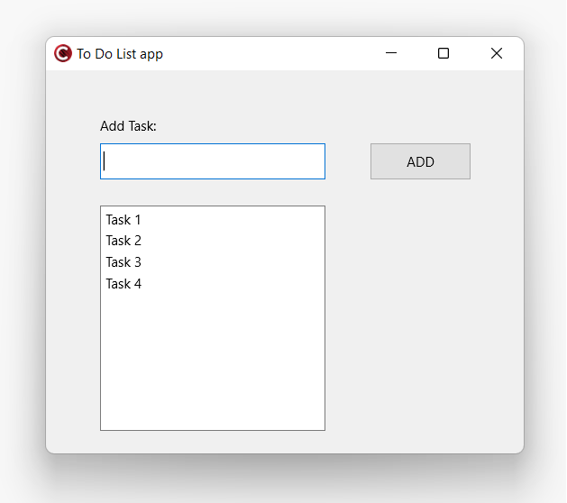

# To_Do_List_app

This is a simple to do list app created with C++ Builder for Windows. It is a simple app that allows you to add and delete tasks.

## How to use

1. Download the source code

2. Open the project in C++ Builder

3. Run the project in the IDE, and the app will open. The app looks like this:

## How to use the app

1. Add a task by typing it in the text box and clicking the add button or pressing enter

2. Delete a task by clicking in the task inside the list box

